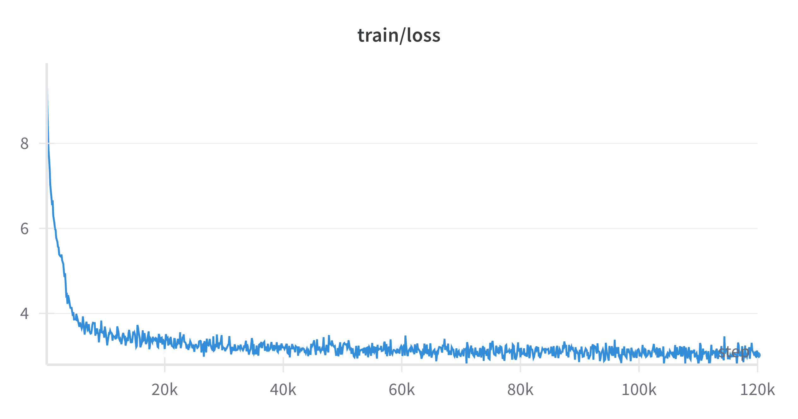
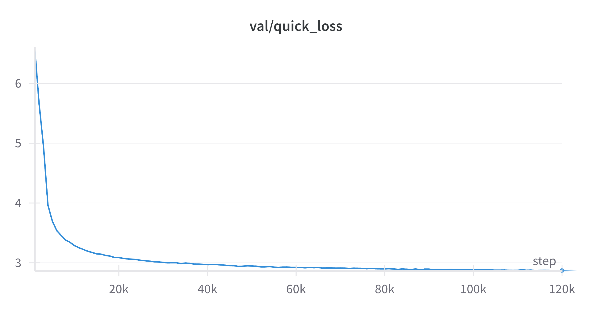
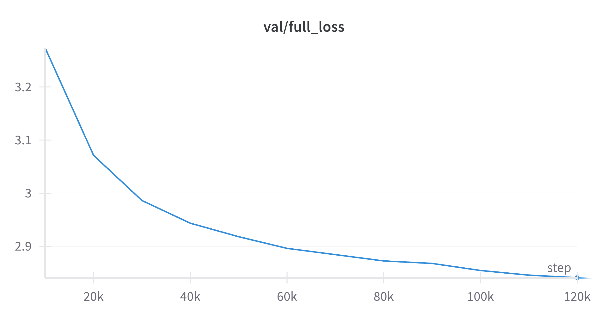
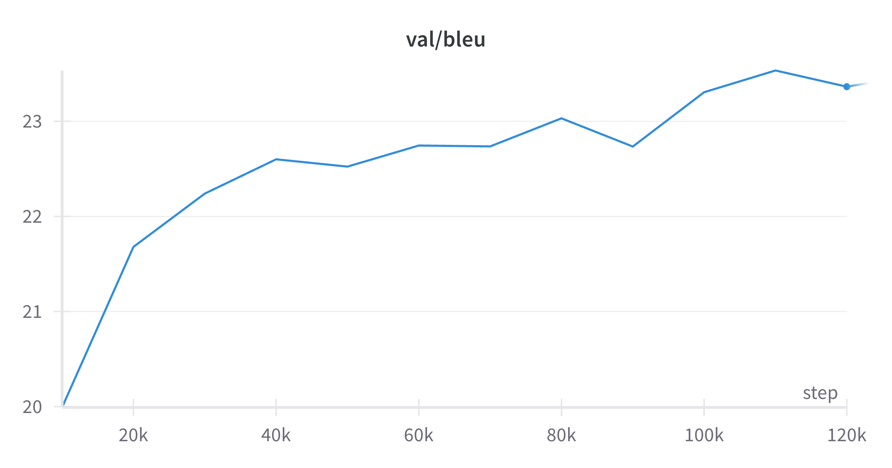

# Transformer From Scratch

A Transformer model implementation from scratch using PyTorch.

## Setup

This project requires conda for managing PyTorch and NumPy dependencies. Other development tools are installed via pip.

### Installation

```bash
git clone https://github.com/henok3878/transformer-from-scratch.git
cd transformer-from-scratch

# CPU version
conda env create -f environment-cpu.yml
conda activate transformer-cpu

# GPU version (with CUDA)
conda env create -f environment-gpu.yml
conda activate transformer-gpu
```

## Development

### Code Quality Tools

```bash
black src/ tests/     # Format code
isort src/ tests/     # Sort imports
flake8 src/ tests/    # Lint code
mypy src/            # Type checking
```

### Testing

```bash
pytest                    # Run tests
pytest --cov=transformer # With coverage
```

## Experiment Tracking

This project uses [Weights & Biases (wandb)](https://wandb.ai/) for experiment tracking. Key metrics like loss, perplexity, and BLEU scores are automatically logged, along with model configurations and checkpoint during training.

### Setup & Usage

1.  **Sign up** for a free account at [wandb.ai](https://wandb.ai).
2.  **Login** to your account from your terminal by running the following command and providing your API key:
    ```bash
    wandb login
    ```
3.  Once you've logged in, the training script (`train.py`) will automatically create a new run in your `wandb` project (`transformer-from-scratch`). You can monitor your experiments live from your `wandb` dashboard.

[**View Project on W&B &rarr;**](https://wandb.ai/henokwondimu/transformer-from-scratch)

## Project Structure

```
src/transformer/
├── components/
│   ├── multi_head.py          # Multi-head attention
│   ├── encoder_block.py       # Transformer encoder
│   ├── decoder_block.py       # Transformer decoder
│   ├── input_embedding.py     # Token embeddings
│   ├── positional_encoding.py # Position embeddings
│   ├── feed_forward.py        # Position wise feed forward network
│   └── layer_norm.py          # Layer normalization
├── transformer.py             # Complete model
└── train.py                   # Training script

tests/                         # Unit tests
```

## Model Training

This project supports both single-node single-GPU and distributed multi-GPU training.

### Single-Node Single-GPU Training

For basic training on one GPU, simply run:

```bash
python train.py --config configs/config_de-en.yaml
```

No `.env` or `hostfile` setup is required.

---

### Multi-GPU Training (Single-Node or Multi-Node)

For training on multiple GPUs (either on one node or across several nodes), set up your `.env` file:

```properties
MASTER_ADDR=node001      # or your master node's hostname
MASTER_PORT=29500
NNODES=1                   # set to 1 for single-node, >1 for multi-node
GPUS_PER_NODE=2            # set to number of GPUs per node
NCCL_DEBUG=INFO
```

For multi-node training, also create a `hostfile` listing all participating nodes one per line in order of rank (master node first, then worker nodes):

```
node001
node002
node003
```

Then launch distributed training by running the following command on each node:

```bash
bash run_dist.sh
```

Checkpoints are saved under `experiments/` and tracked with wandb.

## Training & Evaluation Results

- **Training Loss:**  
  

- **Quick Validation Loss (subset, every 1000 steps):**  
  

- **Full Validation Loss (entire set, every 10,000 steps):**  
  

- **Validation BLEU (greedy search, every 10,000 steps):**  
  

- **Final Test BLEU (beam search, beam size=4):**
  Using the default configuration, the model achieved a BLEU score of **25.53** on the official WMT14 test set (news-test) using beam search with beam size 4.

## License

MIT
